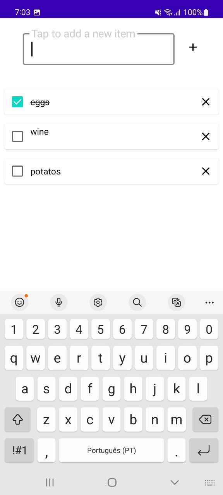
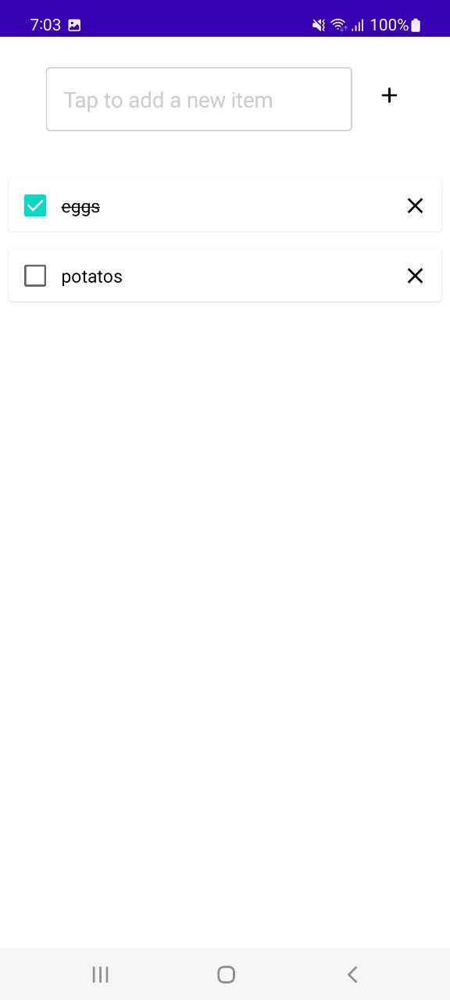

# Shopping List (Kotlin)

   
  

The goal of the application is to make everyday shopping easier by enabling the user to list down items to buy.
Using 'My Shopping List' application the user can add/delete new items to buy, and while using it the user can check/uncheck according the user needs.

## How to compile and run the application.
The application is created with Android SDK and is compiled by Android Studio, generating an .apk to be installed in any Android device.

## How to run tests for the application.
Right click at UITest.kt and select "Run tests" - make sure to have a device unlocked connected via ADB - the Android Studio will run the application and perform the
steps declared in the file. The tests with comments are possibilities to be included - easier to make it works if applying dependency injection as Hilt and libraries as Mockk.

## A few sentences about the overall architecture of the application.
Android application created with modern technologies like Kotlin and Jetpack Compose, using reactivity to share states between domain and UI.
Using Retrofit as HTTP client to integrate the backend hosted at Firebase.

Besides the required functional requirements, added the SwipeRefresh feature, to make easier when testing it at the same time with other
application instance, for example, with the Flutter version.
